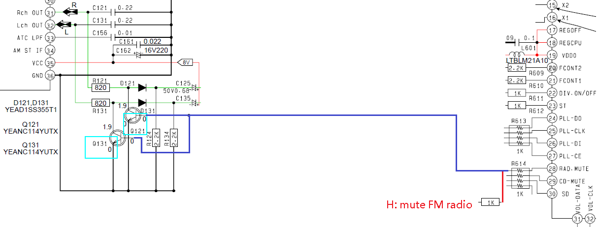
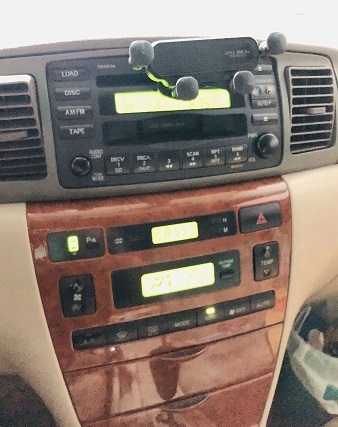

## Install esp-idf enviroment on ubuntu 22.04
[refer](https://docs.espressif.com/projects/esp-idf/en/release-v5.4/esp32/get-started/linux-macos-setup.html#)  

clone sdk, install toolchain and export path
```
git clone -b v5.4 --recursive https://github.com/espressif/esp-idf.git esp-idf-v5.4
cd esp-idf-v5.4/
./install.sh
. ./export.sh
```

##  build
1. clone this example and build  
```
git clone https://github.com/eiffelpeter/esp32_a2dp_sink.git
cd esp32_a2dp_sink
idf.py set-target esp32
idf.py build
```  
2. connect `esp-prog` to ubuntu usb, check `/dev/ttyUSB1` exist.  
3. connect `esp-prog` to esp32.  
4. Download and run `idf.py -p /dev/ttyUSB1 flash monitor`.  
5. open your phone to search bt and pair, then play music.  
6. If you want to listen FM radio, tund off bt on your phone.  

## gpios 
| esp32 |          |
|-------|----------|
|  17   | I2S_LRCK |
|  18   | I2S_BCK  |
|  23   | I2S_DATA |
|  19   | mute     |
|  22   | led      |

| mute |                               |
|------|-------------------------------|
| high | unmute pcm5102, mute FM radio |
| low  | mute pcm5102, unmute FM radio |


## power 
  


## pcm5102 config ( green circle )
  

## esp32 and pcm5102 connection
  

## pcm5102 L/R audio to car stereo
  

## esp32 mute FM radio when a2dp streaming
  

## connect esp32 to car stereo ( remove tape and cd player )   
  

## install on car with phone holder
  

## You can use ESP32-DevKitC WROVER to develop.
 

## Reference
[link](https://github.com/espressif/esp-idf/issues/14795)  
